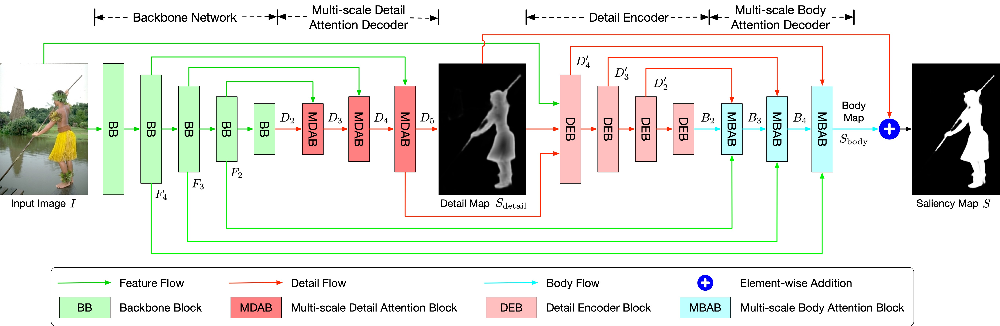

# DisentangleSaliency
ACM TOMM Paper "[Disentangle Saliency Detection into Cascaded Detail Modeling and Body Filling](https://arxiv.org/pdf/2202.04112.pdf)"

## Overview



## Pre-trained Model 

The pre-trained model is available via [this link](https://drive.google.com/file/d/1hv3PRfGZX9yDYVogJOFi3wGN4T74i5gM/view?usp=sharing).

## Citation

Please consider citing our paper if you think the code is helpful to your research.

```
@inproceedings{song2022disentangle,
  title={Disentangle Saliency Detection into Cascaded Detail Modeling and Body Filling},
  author={Song, Yue and Tang, Hao and Sebe, Nicu and Wang, Wei},
  booktitle={ACM TOMM},
  year={2022}
}
```


## Contact

If you have any questions or suggestions, please feel free to contact me

`yue.song@unitn.it`
